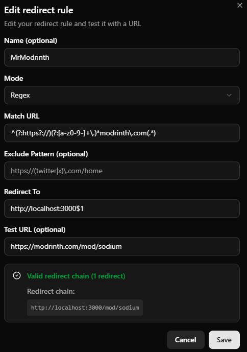

# MrModrinth

**This is a fork of the [modrinth-proxy](https://github.com/b0b0b0b0b0b0b0b0b0b0b0b0b0b0b0b0/modrinth-proxy) project.**

**Original author:** [BoBoBo](https://github.com/b0b0b0b0b0b0b0b0b0b0b0b0b0b0b0b0)

**License:** [GNU Affero General Public License v3](LICENSE)

Modrinth's web interface in Russian. Easy access to mods, plugins, shaders, and other Minecraft content without a VPN or any hassle.

All files are downloaded directly from Modrinth's CDN.

## For rights holders

> **No drama — your work has not been stolen.** We're just a **small proxy** in front of a great platform, and anyone can run this on their own PC or virtual server.
>
> We simply can't build the same kind of payment system Modrinth has — royalties for views and downloads require infrastructure way beyond what we can realistically run. And to be clear: **we make absolutely nothing from this project.** No money from traffic, no money from downloads — we don't even have servers to pay for, because this tool runs locally on your own machine or infrastructure.

# Local development
### Clone the repository
```bash 
git clone https://github.com/byMr712/MrModrinth.git
```
### Go to the project folder
```bash 
cd MrModrinth
```
### Installing dependencies
```bash 
npm install
```

## Start
Start the `start-MrModrinth.bat` file in the project folder.

The site will be available at `http://localhost:3000`. All requests to the Modrinth API will originate from your IP address, so you will have your own rate limit.

## Stop
Stop the `stop-MrModrinth.bat` file in the project folder.

#Redirection
Redirects from the official Modrinth website to your local one are supported. To set this up, install the "[Redirector](https://chromewebstore.google.com/detail/redirector/lioaeidejmlpffbndjhaameocfldlhin)" Chrome extension and add a rule as shown in the photo below.

<details>
<summary>🖼️ Click to show the photo</summary>

</details>

### Match URL
```bash
^(?:https?://)(?:[a-z0-9-]+\.)*modrinth\.com(.*)
```

### Redirect To
```bash
http://localhost:3000$1
```

### Test URL
```bash
https://modrinth.com/mod/sodium
```

# Caching
API requests are cached using the built-in Next.js system (`revalidate`):
- Minecraft servers: 180 seconds (3 minutes)
- Project search: 10,800 seconds (3 hours)
- Project/mod details: 60 seconds (1 minute)
- Project versions: 21,600 seconds (6 hours)
- Version details: 21,600 seconds (6 hours)
- Project team: 86,400 seconds (24 hours)
- Users: 43,200 seconds (12 hours)
- Minecraft versions: 86,400 seconds (24 hours)
- Categories: 604,800 seconds (7 days)
- Project count on homepage: 86,400 seconds (24 hours)

